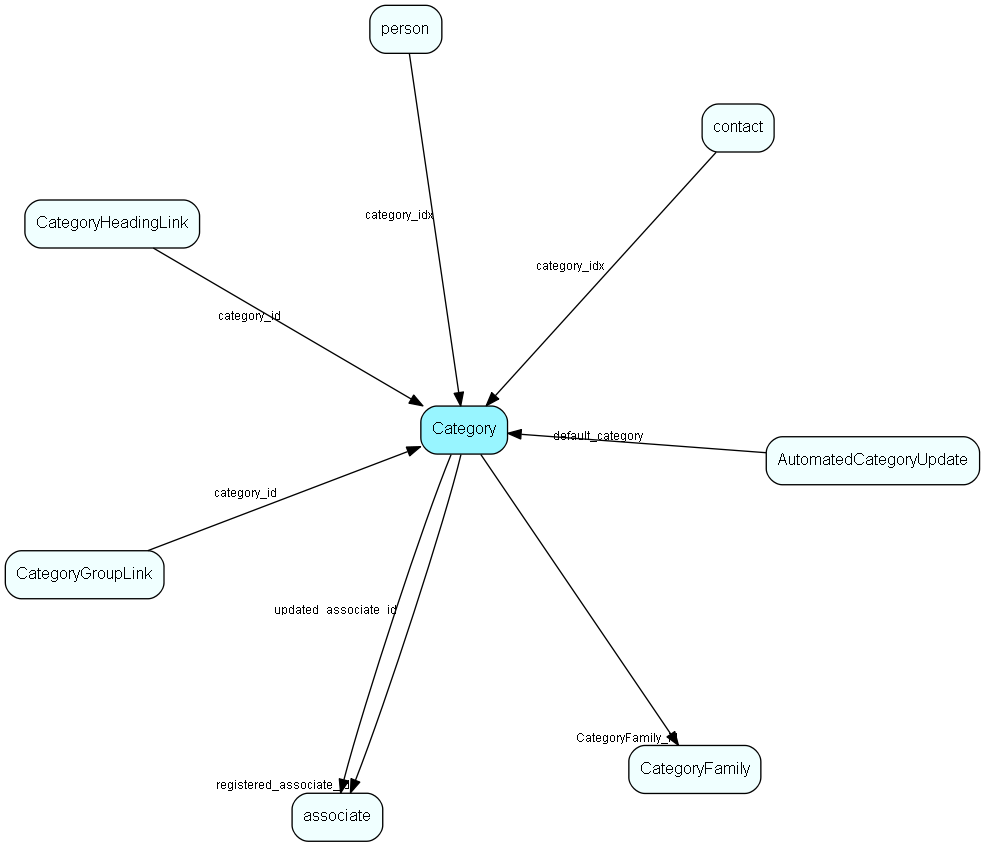

import Category from "./includes/category.md";

# Category Table (64)

Category MDO list item table.
Category list table

## Fields

| Name | Description | Type | Null |
|------|-------------|------|:----:|
|Category\_id|Primary key|PK| |
|name|The list item|String(239)| |
|rank|Rank order |UShort|&#x25CF;|
|tooltip|Tooltip or other description|String(254)|&#x25CF;|
|deleted|0 -&gt; record is active 1 -&gt; record is &apos;deleted&apos; and should not be shown in lists|UShort|&#x25CF;|
|registered|Registered when|UtcDateTime| |
|registered\_associate\_id|Registered by whom|FK [associate](./associate)| |
|updated|Last updated when|UtcDateTime| |
|updated\_associate\_id|Last updated by whom|FK [associate](./associate)| |
|updatedCount|Number of updates made to this record|UShort| |
|CategoryFamily\_id|Optional link to family, for grouping things like multiple kinds of customer category under family &apos;customer&apos;|FK [CategoryFamily](./categoryfamily)|&#x25CF;|
|category\_group|Category group|Enum [CategoryGroup](./enums/categorygroup)|&#x25CF;|
|enable\_lead\_status|Enable lead status qualification for categorygroup potential customers|Bool|&#x25CF;|

<Category />

## Indexes

| Fields | Types | Description |
|--------|-------|-------------|
|name |String(239) |Unique |

## Relationships

| Table|  Description |
|------|-------------|
|[associate](./associate)  |Employees, resources and other users - except for External persons |
|[AutomatedCategoryUpdate](./automatedcategoryupdate)  |Info on how to autoupdate category when changing sale or leadstatus on person |
|[CategoryFamily](./categoryfamily)  |Grouping table so that multiple company categories can be grouped under one term; to simplify searching for things like &apos;all customers&apos; |
|[CategoryGroupLink](./categorygrouplink)  |User group link table for Category, for MDO item hiding |
|[CategoryHeadingLink](./categoryheadinglink)  |Heading link table for Category, for MDO headers |
|[contact](./contact)  |Companies and Organizations. |
|[person](./person)  |Persons |

## Replication Flags

* Replicate changes DOWN from central to satellites and travellers.
* Replicate changes UP from satellites and travellers back to central.
* Copy to satellite and travel prototypes.

## Security Flags

* No access control via user's Role.
