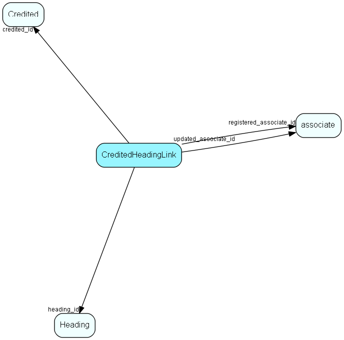

import Creditedheadinglink from "./includes/creditedheadinglink.md";

# CreditedHeadingLink Table (99)

Heading link table for Credited, for MDO headers

## Fields

| Name | Description | Type | Null |
|------|-------------|------|:----:|
|creditedheadinglink\_id|Primary key|PK| |
|credited\_id|Link to Credited list table|FK [Credited](./credited)| |
|heading\_id|Link to Heading table|FK [Heading](./heading)| |
|registered|Registered when|UtcDateTime| |
|registered\_associate\_id|Registered by whom|FK [associate](./associate)| |
|updated|Last updated when|UtcDateTime| |
|updated\_associate\_id|Last updated by whom|FK [associate](./associate)| |
|updatedCount|Number of updates made to this record|UShort| |

<Creditedheadinglink />

## Indexes

| Fields | Types | Description |
|--------|-------|-------------|
|credited\_id |FK |Index |
|heading\_id |FK |Index |

## Relationships

| Table|  Description |
|------|-------------|
|[associate](./associate)  |Employees, resources and other users - except for External persons |
|[Credited](./credited)  |Credited list table. List of who is to be credited for the sale. |
|[Heading](./heading)  |Heading items for all MDO lists, lists that are grouped and filtered. |

## Replication Flags

* Replicate changes DOWN from central to satellites and travellers.
* Replicate changes UP from satellites and travellers back to central.
* Copy to satellite and travel prototypes.

## Security Flags

* No access control via user's Role.
