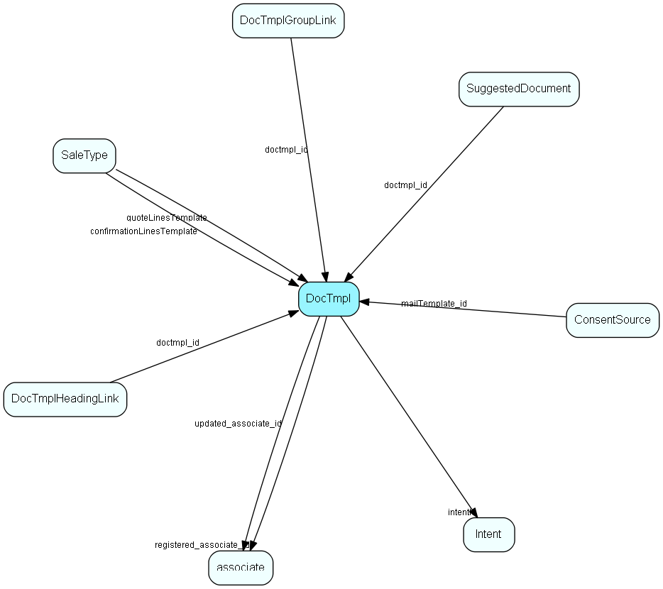

import Doctmpl from "./includes/doctmpl.md";

# DocTmpl Table (130)

DocTmpl MDO list item table.
DocTmpl list table. Describes templates available for writing new documents.

## Fields

| Name | Description | Type | Null |
|------|-------------|------|:----:|
|DocTmpl\_id|Primary key|PK| |
|name|The list item|String(239)| |
|rank|Rank order|UShort|&#x25CF;|
|tooltip|Tooltip or other description|String(254)|&#x25CF;|
|deleted|0 -&gt; record is active 1 -&gt; record is &apos;deleted&apos; and should not be shown in lists|UShort|&#x25CF;|
|filename|Relative to TemplatePath in SOARC. Plugin specific extref in other doc archives. i.e. Google document URL or Notes id.|String(239)| |
|autoevent\_id|Document plugin id - where the documents generated from this template are to be stored. Copied to the document.archiveProvider when document is created.|Id|&#x25CF;|
|record\_type|1 = app, 2 = doc, 3 = email, 4 = fax, 5 = phone, 6 = todo - see EAppntRecordTypes|Enum [DocTmplType](./enums/doctmpltype)| |
|direction|1 = incoming, 2 = outgoing, see EAppntDirection|Enum [DocTmplDirection](./enums/doctmpldirection)|&#x25CF;|
|saveInDb|1 = save document records in DB; otherwise not.|UShort|&#x25CF;|
|default\_oref|Processed via tag substitution to give document reference|String(239)|&#x25CF;|
|regkey\_open|Registry key to use for Open, if blank, we simply ask Windows to do the operation for us|String(239)|&#x25CF;|
|regkey\_edit|Registry key to use for Edit; if blank, we simply ask Windows to do the operation for us|String(239)|&#x25CF;|
|regkey\_print|Registry key to use for Print; if blank, we simply ask Windows to do the operation for us|String(239)|&#x25CF;|
|accelerator|Accelerator key code for this template|UShort|&#x25CF;|
|registered|Registered when|UtcDateTime| |
|registered\_associate\_id|Registered by whom|FK [associate](./associate)| |
|updated|Last updated when|UtcDateTime| |
|updated\_associate\_id|Last updated by whom|FK [associate](./associate)| |
|updatedCount|Number of updates made to this record|UShort| |
|defaultPublishType|Should documents based on this template be published=true? Default state of publish flag on documents.|Enum [PublishType](./enums/publishtype)|&#x25CF;|
|intentId|What is the intention of this document (used by SAINT)|FK [Intent](./intent)|&#x25CF;|
|mimeType|The MIME type, for Web/Browser use of documents of this type|String(254)|&#x25CF;|
|loadTemplateFromPlugin|If nonzero, then this is the ID of the document plugin that should supply the template document file, instead of the default so_arc/template|Int|&#x25CF;|
|quoteDocType|The role this document plays in the Quote system, if any|Enum [DocTmplQuoteType](./enums/doctmplquotetype)|&#x25CF;|
|privacyDocType|Indicator that this document template has a functional role, related to privacy/GDPR|Enum [DocTmplPrivacyType](./enums/doctmplprivacytype)|&#x25CF;|
|emailSubject|Subject line for document templates that represent an email; template tags are accepted in this item|String(4000)|&#x25CF;|
|includeSignature|If True, signature (mail.htm) should be added at bottom of template when used|Bool|&#x25CF;|
|showCurrents|If True, A dialog or sidebar will be shown for changing current values on Contact, Person  |Bool|&#x25CF;|
|senderEmailMode|Type of sender email setting. Always use senderEmailAddress = 0, Use Our contact = 1, Use Support Associate = 2|Enum [SenderMailMode](./enums/sendermailmode)|&#x25CF;|
|senderEmailAddress|The email address to use in from field|String(256)|&#x25CF;|
|invitationDocType|Type for sending email meeting invitation. Not an invitation type template = 0, New = 1, Changed = 2, Cancelled = 3|Enum [DocTmplInvitationType](./enums/doctmplinvitationtype)|&#x25CF;|

<Doctmpl />

## Indexes

| Fields | Types | Description |
|--------|-------|-------------|
|name |String(239) |Unique |

## Relationships

| Table|  Description |
|------|-------------|
|[associate](./associate)  |Employees, resources and other users - except for External persons |
|[ConsentSource](./consentsource)  |Consent source for GDPR |
|[DocTmplGroupLink](./doctmplgrouplink)  |User group link table for DocTmpl, for MDO item hiding |
|[DocTmplHeadingLink](./doctmplheadinglink)  |Heading link table for DocTmpl, for MDO headers |
|[Intent](./intent)  |Intent list for SAINT. More information regarding SuperOffice Sales Intelligence on http://techdoc.superoffice.com  |
|[SaleType](./saletype)  |Type of sale - large solution, incremental, whatever fits the organization |
|[SuggestedDocument](./suggesteddocument)  |Unique owner of a set of licensed modules |

## Replication Flags

* Replicate changes DOWN from central to satellites and travellers.
* Replicate changes UP from satellites and travellers back to central.
* Copy to satellite and travel prototypes.

## Security Flags

* No access control via user's Role.
