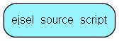

import EjselSourceScript from "./includes/ejsel-source-script.md";

# ejsel\_source\_script Table (394)

This table stores a selection script source

## Fields

| Name | Description | Type | Null |
|------|-------------|------|:----:|
|id|Primary key|PK| |
|body|The script body|Clob|&#x25CF;|

<EjselSourceScript />

## Indexes

| Fields | Types | Description |
|--------|-------|-------------|

## Replication Flags

* None

## Security Flags

* No access control via user's Role.
