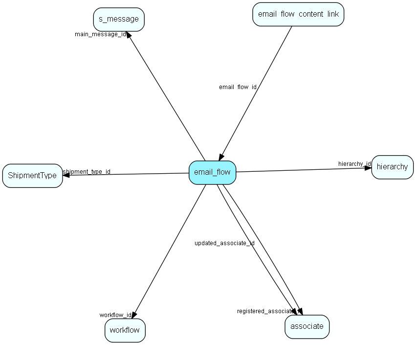

import EmailFlow from "./includes/email-flow.md";

# email\_flow Table (526)

A set of properties related to the email workflow.

## Fields

| Name | Description | Type | Null |
|------|-------------|------|:----:|
|email\_flow\_id|Primary key|PK| |
|workflow\_id|The workflow this emailflow belongs to|FK [workflow](./workflow)|&#x25CF;|
|shipment\_type\_id|Mailing type (subscription type)|FK [ShipmentType](./shipmenttype)|&#x25CF;|
|override\_consent\_subscription|Override consent and subscription|Bool|&#x25CF;|
|registered|Registered when|UtcDateTime| |
|registered\_associate\_id|Registered by whom|FK [associate](./associate)| |
|updated|Last updated when|UtcDateTime| |
|updated\_associate\_id|Last updated by whom|FK [associate](./associate)| |
|updatedCount|Number of updates made to this record|UShort| |
|hierarchy\_id|This email flow is inside that hierarchy folder|FK [hierarchy](./hierarchy)| |
|from\_name|Email From name|String(255)|&#x25CF;|
|from\_addr|Email From address: name@domain.com|String(255)|&#x25CF;|
|reply\_to\_addr|Reply to address, if different from From-address|String(255)|&#x25CF;|
|sms\_sender|SMS sender (number or name)|String(255)|&#x25CF;|
|use\_timeframe|Use sender timeframe settings, only send email/sms within the timeframe|Bool|&#x25CF;|
|selected\_days|Selected days (flags, so several days can be selected) for time frame|Enum [Weekday](./enums/weekday)|&#x25CF;|
|timeframe\_start|Start of email/sms sending timeframe, interpreted in stored timezone or as UTC, only time part is used|UtcDateTime|&#x25CF;|
|timeframe\_end|End of email/sms sending timeframe, interpreted in stored timezone or as UTC, only time part is used|UtcDateTime|&#x25CF;|
|use\_google\_analytics|Use Google Analytics|Bool|&#x25CF;|
|ga\_source|GA Source|String(255)|&#x25CF;|
|ga\_campaign|GA Campaign|String(255)|&#x25CF;|
|from\_type|Email/Mailing From field address algorithm|Enum [EmailFromType](./enums/emailfromtype)|&#x25CF;|
|reply\_to\_type|Email/Mailing Reply-To field address algorithm|Enum [EmailReplyToType](./enums/emailreplytotype)|&#x25CF;|
|reply\_to\_name|Email Reply-To name|String(255)|&#x25CF;|
|main\_message\_id|The main email message, used for thumbnail creation|FK [s_message](./s-message)|&#x25CF;|

<EmailFlow />

## Indexes

| Fields | Types | Description |
|--------|-------|-------------|
|hierarchy\_id |FK |Index |

## Relationships

| Table|  Description |
|------|-------------|
|[associate](./associate)  |Employees, resources and other users - except for External persons |
|[email\_flow\_content\_link](./email-flow-content-link)  |Links content to an email workflow |
|[hierarchy](./hierarchy)  |This table contains folders used to group the extra tables in the system. |
|[s\_message](./s-message)  |A message used in a shipment. Can be html and/or plain text |
|[ShipmentType](./shipmenttype)  |Shipment type list table. Classification of a mailing, allowing recipients to subscribe to lists |
|[workflow](./workflow)  |SuperOffice specific info about a workflow |

## Replication Flags

* None

## Security Flags

* Sentry controls access to items in this table using user's Role and data rights matrix on the table's parent.
