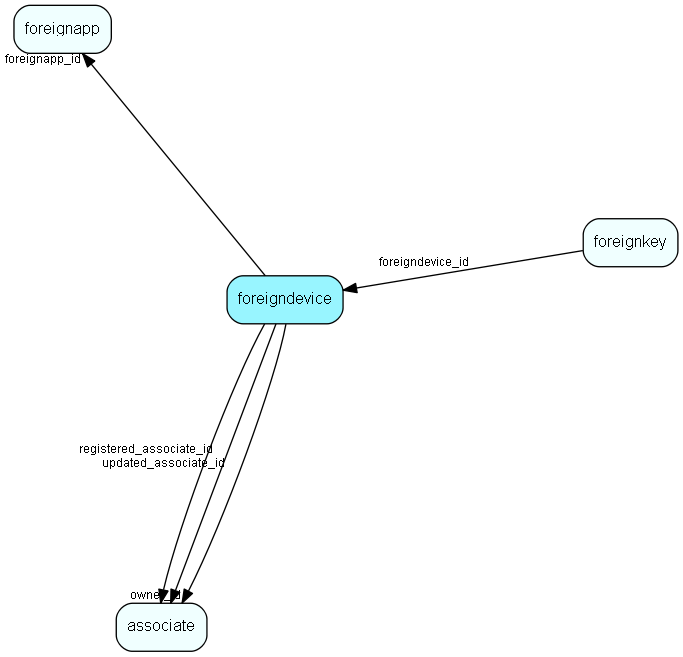

import Foreigndevice from "./includes/foreigndevice.md";

# foreigndevice Table (182)

Middle level of Foreign Key system

## Fields

| Name | Description | Type | Null |
|------|-------------|------|:----:|
|foreigndevice\_id|Primary key|PK| |
|name|Name of device|String(31)| |
|device\_id|Optional unique id of device (Palm pilot device ID, etc)|String(239)|&#x25CF;|
|foreignapp\_id|Reference to foregin application (device type)|FK [foreignapp](./foreignapp)| |
|owner\_id|Reference to SO user owning this device|FK [associate](./associate)| |
|lastsynced|Last sync date|DateTime|&#x25CF;|
|lastsynced\_trans|Last sync traveltransactionlog id number|DateTime|&#x25CF;|
|registered|Registered when|UtcDateTime| |
|registered\_associate\_id|Registered by whom|FK [associate](./associate)| |
|updated|Last updated when|UtcDateTime| |
|updated\_associate\_id|Last updated by whom|FK [associate](./associate)| |
|updatedCount|Number of updates made to this record|UShort| |

<Foreigndevice />

## Indexes

| Fields | Types | Description |
|--------|-------|-------------|
|name |String(31) |Index |
|device\_id |String(239) |Index |
|foreignapp\_id |FK |Index |
|owner\_id |FK |Index |

## Relationships

| Table|  Description |
|------|-------------|
|[associate](./associate)  |Employees, resources and other users - except for External persons |
|[foreignapp](./foreignapp)  |Top level of Foreign Key system |
|[foreignkey](./foreignkey)  |Foreign Key - enables storage of arbitrary extra key information for every table/row in SuperOffice. You may use this table to store your extra information instead of using the dictionary SDK to create your own tables. |

## Replication Flags

* Replicate changes DOWN from central to satellites and travellers.
* Replicate changes UP from satellites and travellers back to central.
* Copy to satellite and travel prototypes.

## Security Flags

* No access control via user's Role.
