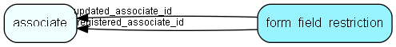

import FormFieldRestriction from "./includes/form-field-restriction.md";

# form\_field\_restriction Table (490)

This table contains all form fields restrictions

## Fields

| Name | Description | Type | Null |
|------|-------------|------|:----:|
|form\_field\_restriction\_id|Primary key|PK| |
|field\_identifier|the identifier for the field|String(255)|&#x25CF;|
|field\_restriction|The restriction set on the field|Enum [FormFieldRestrictionType](./enums/formfieldrestrictiontype)|&#x25CF;|
|registered|Registered when|UtcDateTime| |
|registered\_associate\_id|Registered by whom|FK [associate](./associate)| |
|updated|Last updated when|UtcDateTime| |
|updated\_associate\_id|Last updated by whom|FK [associate](./associate)| |
|updatedCount|Number of updates made to this record|UShort| |

<FormFieldRestriction />

## Indexes

| Fields | Types | Description |
|--------|-------|-------------|
|field\_identifier |String(255) |Unique |

## Relationships

| Table|  Description |
|------|-------------|
|[associate](./associate)  |Employees, resources and other users - except for External persons |

## Replication Flags

* None

## Security Flags

* No access control via user's Role.
