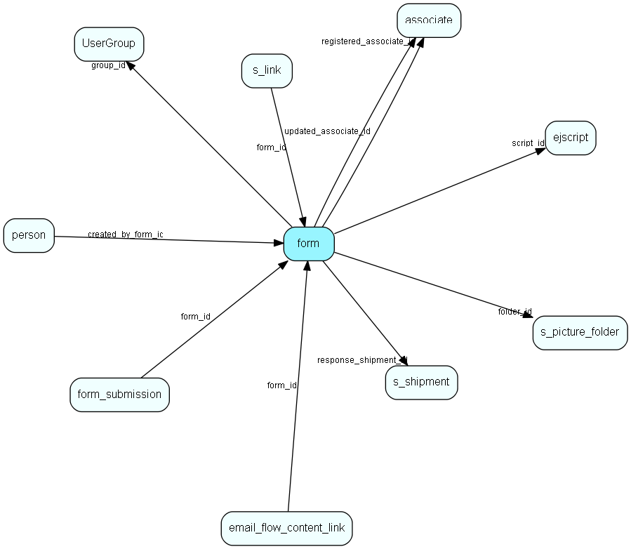

import Form from "./includes/form.md";

# form Table (488)

A form which can be published on a webpage and submitted by visitors

## Fields

| Name | Description | Type | Null |
|------|-------------|------|:----:|
|form\_id|Primary key|PK| |
|name|The name of this form|String(4000)|&#x25CF;|
|description|Detailed description|String(4000)|&#x25CF;|
|config|The JSON-formatted config of this form|Clob|&#x25CF;|
|folder\_id|The folder which this form belongs to. -1 indicates that the shipment is on the root|FK [s_picture_folder](./s-picture-folder)| |
|script\_id|The CRMScript Macro which will be run when the form is submitted.|FK [ejscript](./ejscript)| |
|response\_shipment\_id|The id of the s_shipment that is used to send the response mails|FK [s_shipment](./s-shipment)| |
|registered|Registered when|UtcDateTime| |
|registered\_associate\_id|Registered by whom|FK [associate](./associate)| |
|updated|Last updated when|UtcDateTime| |
|updated\_associate\_id|Last updated by whom|FK [associate](./associate)| |
|updatedCount|Number of updates made to this record|UShort| |
|active|Indicates if this form is active and available for customers|Bool|&#x25CF;|
|expires|After this datetime, the form will become inactive|DateTime|&#x25CF;|
|maxSubmits|After this number of submits, the form will become inactive|Int|&#x25CF;|
|type|What kind of form is this? Indicates if this is a normal form or a template|Enum [FormType](./enums/formtype)| |
|recipe|The JSON-formatted recipe of this form|Clob|&#x25CF;|
|group\_id|The group which this form belongs to.|FK [UserGroup](./usergroup)| |
|form\_key|A short string used as unique id to access this form|String(32)|&#x25CF;|
|new\_ticket|True if this form creates a new ticket|Bool|&#x25CF;|

<Form />

## Indexes

| Fields | Types | Description |
|--------|-------|-------------|
|script\_id |FK |Index |
|response\_shipment\_id |FK |Index |
|form\_key |String(32) |Index |

## Relationships

| Table|  Description |
|------|-------------|
|[associate](./associate)  |Employees, resources and other users - except for External persons |
|[ejscript](./ejscript)  |ejscript |
|[email\_flow\_content\_link](./email-flow-content-link)  |Links content to an email workflow |
|[form\_submission](./form-submission)  |A form submission |
|[person](./person)  |Persons |
|[s\_link](./s-link)  |Links in messages to measure success rate of a campaign. |
|[s\_picture\_folder](./s-picture-folder)  |This table contains all picture folders |
|[s\_shipment](./s-shipment)  |Contains info about one shipment. The addresses are stored in s_shipment_addr |
|[UserGroup](./usergroup)  |Secondary user groups |

## Replication Flags

* None

## Security Flags

* No access control via user's Role.
