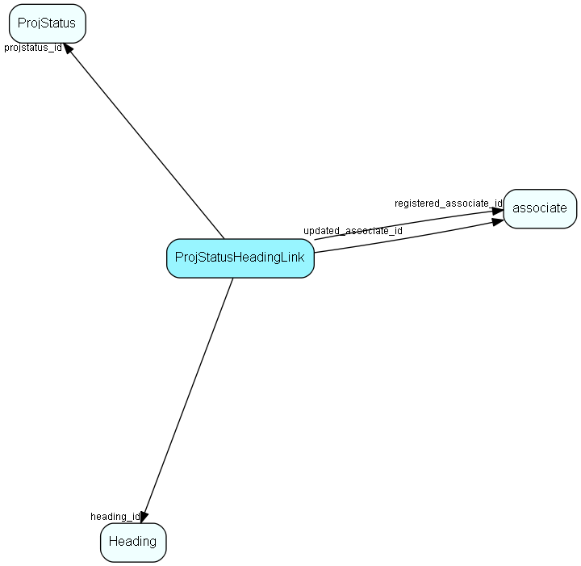

import Projstatusheadinglink from "./includes/projstatusheadinglink.md";

# ProjStatusHeadingLink Table (90)

Heading link table for ProjStatus, for MDO headers

## Fields

| Name | Description | Type | Null |
|------|-------------|------|:----:|
|projstatusheadinglink\_id|Primary key|PK| |
|projstatus\_id|Link to ProjStatus list table|FK [ProjStatus](./projstatus)| |
|heading\_id|Link to Heading table|FK [Heading](./heading)| |
|registered|Registered when|UtcDateTime| |
|registered\_associate\_id|Registered by whom|FK [associate](./associate)| |
|updated|Last updated when|UtcDateTime| |
|updated\_associate\_id|Last updated by whom|FK [associate](./associate)| |
|updatedCount|Number of updates made to this record|UShort| |

<Projstatusheadinglink />

## Indexes

| Fields | Types | Description |
|--------|-------|-------------|
|projstatus\_id |FK |Index |
|heading\_id |FK |Index |

## Relationships

| Table|  Description |
|------|-------------|
|[associate](./associate)  |Employees, resources and other users - except for External persons |
|[Heading](./heading)  |Heading items for all MDO lists, lists that are grouped and filtered. |
|[ProjStatus](./projstatus)  |ProjStatus list table. Project status |

## Replication Flags

* Replicate changes DOWN from central to satellites and travellers.
* Replicate changes UP from satellites and travellers back to central.
* Copy to satellite and travel prototypes.

## Security Flags

* No access control via user's Role.
