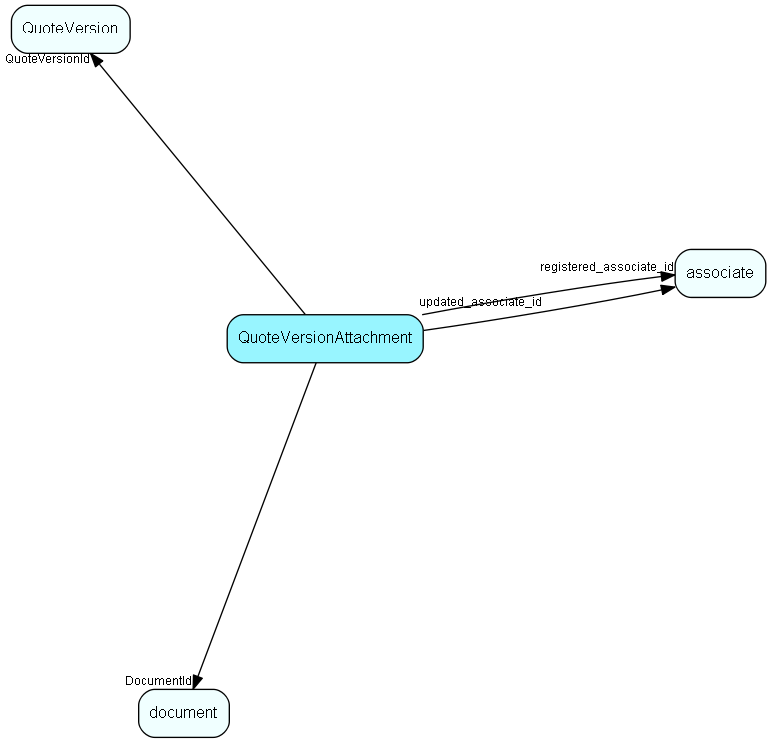

import Quoteversionattachment from "./includes/quoteversionattachment.md";

# QuoteVersionAttachment Table (447)

Actual attachments to a quote

## Fields

| Name | Description | Type | Null |
|------|-------------|------|:----:|
|quoteversionattachment\_id|Primary key|PK| |
|QuoteVersionId|Link to QuoteVersion|FK [QuoteVersion](./quoteversion)| |
|DocumentId|Link to document|FK [document](./document)| |
|Included|Will this attachment be included in the next &apos;Send Quote&apos; operation|Bool|&#x25CF;|
|registered|Registered when|UtcDateTime| |
|registered\_associate\_id|Registered by whom|FK [associate](./associate)| |
|updated|Last updated when|UtcDateTime| |
|updated\_associate\_id|Last updated by whom|FK [associate](./associate)| |
|updatedCount|Number of updates made to this record|UShort| |

<Quoteversionattachment />

## Indexes

| Fields | Types | Description |
|--------|-------|-------------|
|QuoteVersionId, DocumentId |FK, FK |Unique |

## Relationships

| Table|  Description |
|------|-------------|
|[associate](./associate)  |Employees, resources and other users - except for External persons |
|[document](./document)  |Documents, this table is an extension of the Appointment table.  There is always a corresponding appointment record; the relation between appointment and document is navigable in both directions. A document-type appointment record always has a corresponding document record and a record in VisibleFor specifying who may see this.   |
|[QuoteVersion](./quoteversion)  |There may be multiple Versions of a Quote, with one of them active |

## Replication Flags

* Area Management controlled table. Contents replicated to satellites and traveller databases.
* Copy to satellite and travel prototypes.

## Security Flags

* No access control via user's Role.
