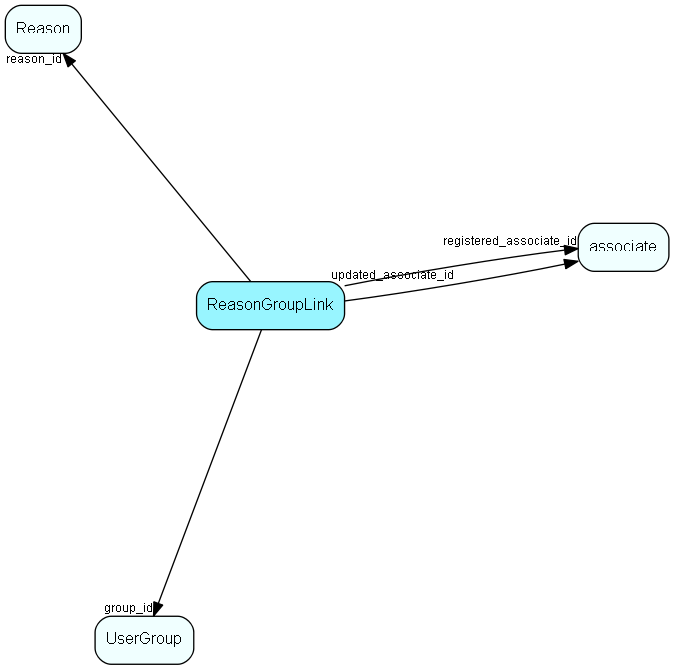

import Reasongrouplink from "./includes/reasongrouplink.md";

# ReasonGroupLink Table (104)

User group link table for Reason, for MDO item hiding

## Fields

| Name | Description | Type | Null |
|------|-------------|------|:----:|
|reasongrouplink\_id|Primary key|PK| |
|reason\_id|Link to Reason list table|FK [Reason](./reason)| |
|group\_id|Link to Group table|FK [UserGroup](./usergroup)| |
|registered|Registered when|UtcDateTime| |
|registered\_associate\_id|Registered by whom|FK [associate](./associate)| |
|updated|Last updated when|UtcDateTime| |
|updated\_associate\_id|Last updated by whom|FK [associate](./associate)| |
|updatedCount|Number of updates made to this record|UShort| |

<Reasongrouplink />

## Indexes

| Fields | Types | Description |
|--------|-------|-------------|
|reason\_id |FK |Index |
|group\_id |FK |Index |

## Relationships

| Table|  Description |
|------|-------------|
|[associate](./associate)  |Employees, resources and other users - except for External persons |
|[Reason](./reason)  |Reason list table. Why we lost the sale (list) |
|[UserGroup](./usergroup)  |Secondary user groups |

## Replication Flags

* Replicate changes DOWN from central to satellites and travellers.
* Replicate changes UP from satellites and travellers back to central.
* Copy to satellite and travel prototypes.

## Security Flags

* No access control via user's Role.
