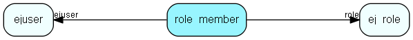

import RoleMember from "./includes/role-member.md";

# role\_member Table (324)

Users linked to a role. Deprecated.

## Fields

| Name | Description | Type | Null |
|------|-------------|------|:----:|
|id|The primary key (auto-incremented)|PK| |
|role|The id of the group.|FK [ej_role](./ej-role)| |
|ejuser|The id of the user.|FK [ejuser](./ejuser)| |

<RoleMember />

## Indexes

| Fields | Types | Description |
|--------|-------|-------------|
|role |FK |Index |
|ejuser |FK |Index |

## Relationships

| Table|  Description |
|------|-------------|
|[ej\_role](./ej-role)  |Define access rights, memberships and other properties for role user members |
|[ejuser](./ejuser)  |This table contains entries for the users of the system. |

## Replication Flags

* None

## Security Flags

* No access control via user's Role.
