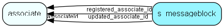

import SMessageblock from "./includes/s-messageblock.md";

# s\_messageblock Table (499)

Contains a block of a mailing message, that can be reused in a mailing

## Fields

| Name | Description | Type | Null |
|------|-------------|------|:----:|
|s\_messageblock\_id|Primary key|PK| |
|block|The block definition. Normally this will be a json structure|Clob|&#x25CF;|
|associateId|The associate that owns this block|FK [associate](./associate)|&#x25CF;|
|registered|Registered when|UtcDateTime| |
|registered\_associate\_id|Registered by whom|FK [associate](./associate)| |
|updated|Last updated when|UtcDateTime| |
|updated\_associate\_id|Last updated by whom|FK [associate](./associate)| |
|updatedCount|Number of updates made to this record|UShort| |

<SMessageblock />

## Indexes

| Fields | Types | Description |
|--------|-------|-------------|

## Relationships

| Table|  Description |
|------|-------------|
|[associate](./associate)  |Employees, resources and other users - except for External persons |

## Replication Flags

* None

## Security Flags

* No access control via user's Role.
