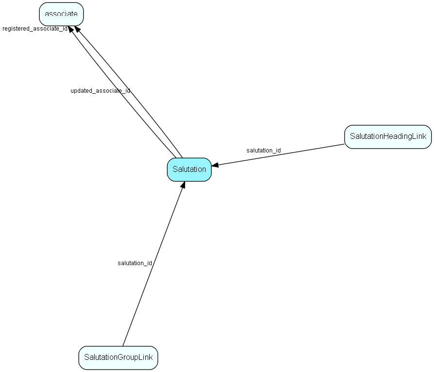

import Salutation from "./includes/salutation.md";

# Salutation Table (219)

Salutation MDO list item table.
Academic title for Person

## Fields

| Name | Description | Type | Null |
|------|-------------|------|:----:|
|Salutation\_Id|Primary key|PK| |
|name|The list item|String(239)| |
|rank|Rank order|UShort|&#x25CF;|
|tooltip|Tooltip or other description|String(254)|&#x25CF;|
|deleted|0 -&gt; record is active 1 -&gt; record is &apos;deleted&apos; and should not be shown in lists|UShort|&#x25CF;|
|registered|Registered when|UtcDateTime| |
|registered\_associate\_id|Registered by whom|FK [associate](./associate)| |
|updated|Last updated when|UtcDateTime| |
|updated\_associate\_id|Last updated by whom|FK [associate](./associate)| |
|updatedCount|Number of updates made to this record|UShort| |

<Salutation />

## Indexes

| Fields | Types | Description |
|--------|-------|-------------|
|name |String(239) |Unique |

## Relationships

| Table|  Description |
|------|-------------|
|[associate](./associate)  |Employees, resources and other users - except for External persons |
|[SalutationGroupLink](./salutationgrouplink)  |User group link table for Salutation, for MDO item hiding |
|[SalutationHeadingLink](./salutationheadinglink)  |Heading link table for Salutation, for MDO headers |

## Replication Flags

* Replicate changes DOWN from central to satellites and travellers.
* Replicate changes UP from satellites and travellers back to central.
* Copy to satellite and travel prototypes.

## Security Flags

* No access control via user's Role.
