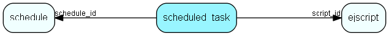

import ScheduledTask from "./includes/scheduled-task.md";

# scheduled\_task Table (376)

A scheduled entry executing a script at certain times

## Fields

| Name | Description | Type | Null |
|------|-------------|------|:----:|
|id|Primary key|PK| |
|script\_id|The id of the script to execute.|FK [ejscript](./ejscript)|&#x25CF;|
|schedule\_id|Update schedule|FK [schedule](./schedule)|&#x25CF;|
|description|Optional description of what this task is used for.|String(2047)|&#x25CF;|

<ScheduledTask />

## Indexes

| Fields | Types | Description |
|--------|-------|-------------|
|script\_id |FK |Index |
|schedule\_id |FK |Index |

## Relationships

| Table|  Description |
|------|-------------|
|[ejscript](./ejscript)  |ejscript |
|[schedule](./schedule)  |Generic scheduled tasked handling time scheduling, locking and error messages |

## Replication Flags

* None

## Security Flags

* No access control via user's Role.
