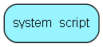

import SystemScript from "./includes/system-script.md";

# system\_script Table (378)

A table containing the system script

## Fields

| Name | Description | Type | Null |
|------|-------------|------|:----:|
|id|Primary key|PK| |
|script\_id|Enum containing the values defining the various scripts|script_id|&#x25CF;|
|body|The script|Clob|&#x25CF;|

<SystemScript />

## Indexes

| Fields | Types | Description |
|--------|-------|-------------|

## Replication Flags

* None

## Security Flags

* No access control via user's Role.
