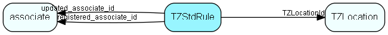

import Tzstdrule from "./includes/tzstdrule.md";

# TZStdRule Table (246)

Time zone rule for standard time

## Fields

| Name | Description | Type | Null |
|------|-------------|------|:----:|
|TZStdRule\_id|Primary key|PK| |
|TZLocationId|Location that this rule is valid for - one location has at least one rule; multiple rules are discerned by their validFrom dates|FK [TZLocation](./tzlocation)| |
|validFrom|Date this rule is valid from|DateTime| |
|bias|number of minutes bias relative to UTC time|Short| |
|description|Description, for identifying the rule in SoAdmin|String(2047)|&#x25CF;|
|isBuiltIn|Is this row part of SuperOffice priming data|Bool|&#x25CF;|
|registered|Registered when|UtcDateTime| |
|registered\_associate\_id|Registered by whom|FK [associate](./associate)| |
|updated|Last updated when|UtcDateTime| |
|updated\_associate\_id|Last updated by whom|FK [associate](./associate)| |
|updatedCount|Number of updates made to this record|UShort| |

<Tzstdrule />

## Indexes

| Fields | Types | Description |
|--------|-------|-------------|
|TZLocationId |FK |Index |

## Relationships

| Table|  Description |
|------|-------------|
|[associate](./associate)  |Employees, resources and other users - except for External persons |
|[TZLocation](./tzlocation)  |Time zone location |

## Replication Flags

* Replicate changes DOWN from central to satellites and travellers.
* Replicate changes UP from satellites and travellers back to central.
* Copy to satellite and travel prototypes.

## Security Flags

* No access control via user's Role.
